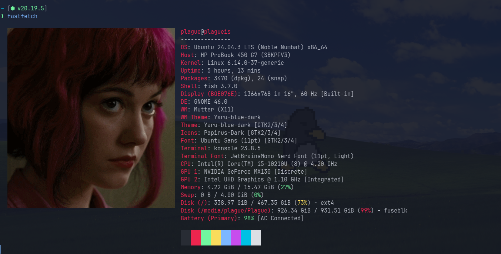
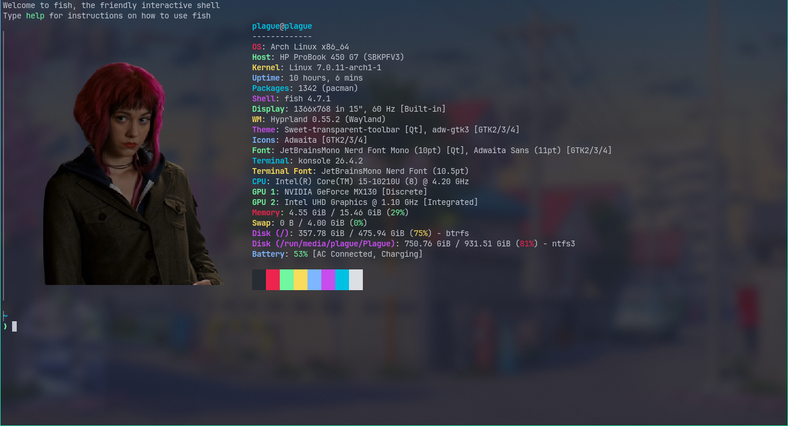

# 🌸 Ramona Flowers Fastfetch Configuration

A custom, Scott Pilgrim-themed `fastfetch` configuration featuring a beautifully aligned Ramona Flowers image logo and a vibrant rainbow color scheme for the system information text.

---

## 📸 Screenshots

### Custom Layout with Rainbow Keys


### Desktop Overview


---

## ✨ Features

- **Ramona Flowers Image Logo**: Configured to display `ramona-flowers.png` natively with alpha transparency preservation (utilizing `kitty` graphics protocol/auto detection).
- **Optimized Alignment**: Configured with custom dimensions (`50x23`) and specific padding (`top: 1`, `right: 2`, `left: 2`) to align perfectly with the text block.
- **Rainbow Key Colors**: Each info category key has been custom-colored with a gorgeous terminal palette rotation (Red, Green, Yellow, Blue, Magenta, Cyan).
- **Tailored Modules List**: Cleaned up to exclude redundant information while retaining important resource details.

---

## 🛠️ Configuration Details

Below is the complete `config.jsonc` used for this setup:

```jsonc
{
  "$schema": "https://github.com/fastfetch-cli/fastfetch/raw/master/doc/json_schema.json",
  "logo": {
    "type": "auto",
    "source": "/home/plague/.config/fastfetch/ramona-flowers.png",
    "width": 50,
    "height": 23,
    "padding": {
      "top": 1,
      "right": 2,
      "left": 2
    }
  },
  "modules": [
    "title",
    "separator",
    {
      "type": "os",
      "keyColor": "red"
    },
    {
      "type": "host",
      "keyColor": "green"
    },
    {
      "type": "kernel",
      "keyColor": "yellow"
    },
    {
      "type": "uptime",
      "keyColor": "blue"
    },
    {
      "type": "packages",
      "keyColor": "blue"
    },
    {
      "type": "shell",
      "keyColor": "magenta"
    },
    {
      "type": "display",
      "keyColor": "green"
    },
    {
      "type": "de",
      "keyColor": "green"
    },
    {
      "type": "wm",
      "keyColor": "yellow"
    },
    {
      "type": "wmtheme",
      "keyColor": "magenta"
    },
    {
      "type": "theme",
      "keyColor": "magenta"
    },
    {
      "type": "icons",
      "keyColor": "cyan"
    },
    {
      "type": "font",
      "keyColor": "green"
    },
    {
      "type": "terminal",
      "keyColor": "cyan"
    },
    {
      "type": "terminalfont",
      "keyColor": "yellow"
    },
    {
      "type": "cpu",
      "keyColor": "cyan"
    },
    {
      "type": "gpu",
      "keyColor": "cyan"
    },
    {
      "type": "memory",
      "keyColor": "green"
    },
    {
      "type": "swap",
      "keyColor": "green"
    },
    {
      "type": "disk",
      "keyColor": "magenta"
    },
    {
      "type": "battery",
      "keyColor": "blue"
    },
    {
      "type": "poweradapter",
      "keyColor": "blue"
    },
    "break",
    "colors"
  ]
}
```

---

## 🚀 How to Install

1. Clone or copy these configuration files into your local fastfetch directory:
   ```bash
   git clone https://github.com/takudzwamvere/fastfetch.git ~/.config/fastfetch
   ```

2. Make sure you have a terminal emulator that supports graphics protocols (such as **Konsole** or **Kitty**) for the image logo to render with transparency.

3. Run `fastfetch` in your terminal!
