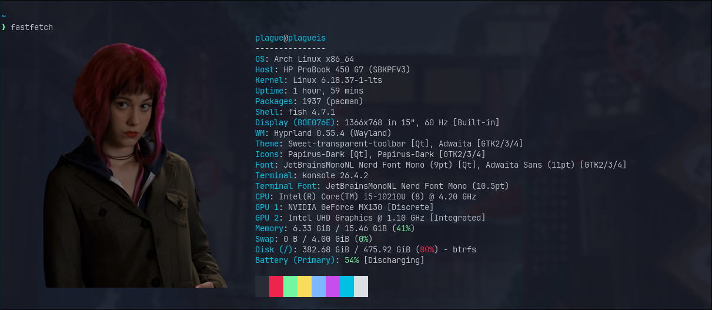
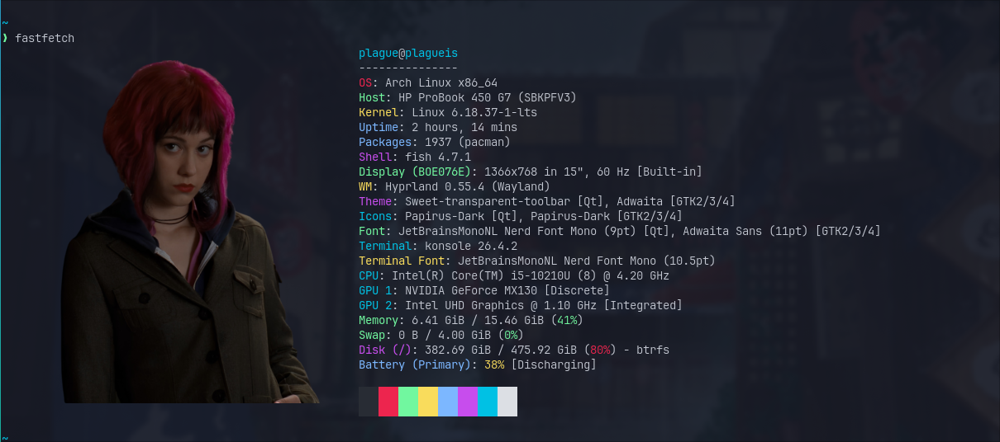

# 🌸 Ramona Flowers Fastfetch Configurations

A custom, Scott Pilgrim-themed `fastfetch` setup featuring a beautifully aligned Ramona Flowers image logo. This repository details two configuration variations: **Default Blue** and **My Own Colorful (Rainbow)**.

---

## 📸 Screenshots

### Default Blue Setup


### My Own Colorful Setup


---

## 🛠️ Configurations

Here are the configuration blocks for both setups:

### 1. My Own Colorful Setup (Active)
This setup applies a vibrant rainbow key color rotation (Red, Green, Yellow, Blue, Magenta, Cyan) to the system details.

```jsonc
{
  "$schema": "https://github.com/fastfetch-cli/fastfetch/raw/master/doc/json_schema.json",
  "logo": {
    "type": "auto",
    "source": "/home/plague/.config/fastfetch/ramona-flowers.png",
    "width": 50,
    "height": 23,
    "padding": {
      "top": 1,
      "right": 2,
      "left": 2
    }
  },
  "modules": [
    "title",
    "separator",
    {
      "type": "os",
      "keyColor": "red"
    },
    {
      "type": "host",
      "keyColor": "green"
    },
    {
      "type": "kernel",
      "keyColor": "yellow"
    },
    {
      "type": "uptime",
      "keyColor": "blue"
    },
    {
      "type": "packages",
      "keyColor": "blue"
    },
    {
      "type": "shell",
      "keyColor": "magenta"
    },
    {
      "type": "display",
      "keyColor": "green"
    },
    {
      "type": "de",
      "keyColor": "green"
    },
    {
      "type": "wm",
      "keyColor": "yellow"
    },
    {
      "type": "wmtheme",
      "keyColor": "magenta"
    },
    {
      "type": "theme",
      "keyColor": "magenta"
    },
    {
      "type": "icons",
      "keyColor": "cyan"
    },
    {
      "type": "font",
      "keyColor": "green"
    },
    {
      "type": "terminal",
      "keyColor": "cyan"
    },
    {
      "type": "terminalfont",
      "keyColor": "yellow"
    },
    {
      "type": "cpu",
      "keyColor": "cyan"
    },
    {
      "type": "gpu",
      "keyColor": "cyan"
    },
    {
      "type": "memory",
      "keyColor": "green"
    },
    {
      "type": "swap",
      "keyColor": "green"
    },
    {
      "type": "disk",
      "keyColor": "magenta"
    },
    {
      "type": "battery",
      "keyColor": "blue"
    },
    {
      "type": "poweradapter",
      "keyColor": "blue"
    },
    "break",
    "colors"
  ]
}
```

### 2. Default Blue Setup
This setup keeps the default terminal/fastfetch blue keys for a clean, classic appearance.

```jsonc
{
  "$schema": "https://github.com/fastfetch-cli/fastfetch/raw/master/doc/json_schema.json",
  "logo": {
    "type": "auto",
    "source": "/home/plague/.config/fastfetch/ramona-flowers.png",
    "width": 50,
    "height": 23,
    "padding": {
      "top": 1,
      "right": 2,
      "left": 2
    }
  },
  "modules": [
    "title",
    "separator",
    "os",
    "host",
    "kernel",
    "uptime",
    "packages",
    "shell",
    "display",
    "de",
    "wm",
    "wmtheme",
    "theme",
    "icons",
    "font",
    "terminal",
    "terminalfont",
    "cpu",
    "gpu",
    "memory",
    "swap",
    "disk",
    "battery",
    "poweradapter",
    "break",
    "colors"
  ]
}
```

---

## 🚀 How to Install

1. Clone or copy these configuration files into your local fastfetch directory:
   ```bash
   git clone https://github.com/takudzwamvere/fastfetch.git ~/.config/fastfetch
   ```

2. Make sure you have a terminal emulator that supports graphics protocols (such as **Konsole** or **Kitty**) for the image logo to render with transparency.

3. Run `fastfetch` in your terminal!
